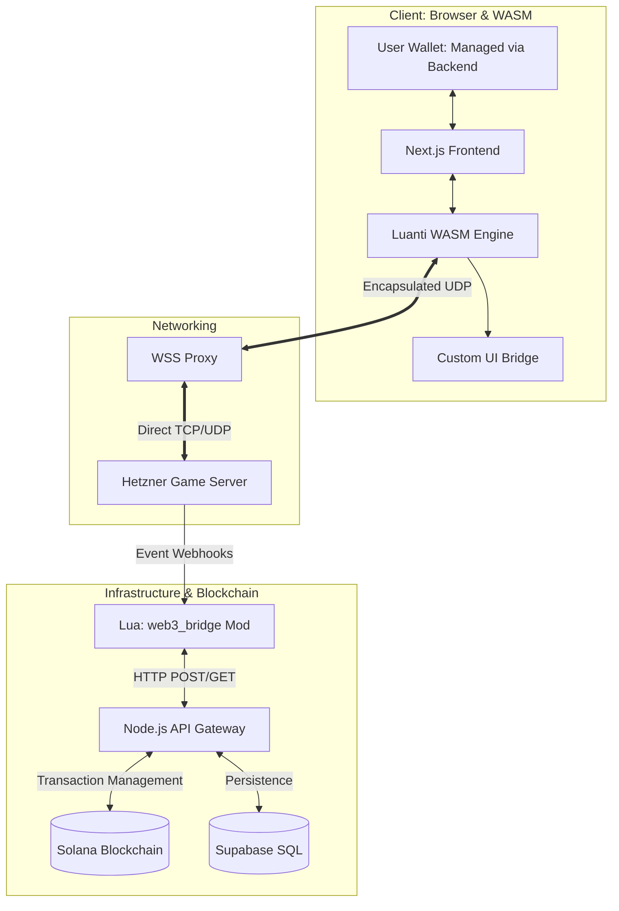

<p align="center">
  <a href="https://solcraft.me">
    
  </a>
</p>

<br><br>

# Solcraft: The Infinite Sovereign Frontier

Solcraft is an uncompromising, browser-based Voxel-Metaverse built natively for the Solana Blockchain. Developed for the **2026 Colosseum Frontier Hackathon**, it serves as a decentralized sandbox where digital property rights are enforced by code, and survival is the only law.

In Solcraft, the "Play-to-Earn" model is replaced by a "High-Stakes" economy. Every block you mine is a token; every death is a permanent loss of state. It is a digital frontier with no borders and no centralized oversight.

---

## 1. System Architecture & Data Flow

Solcraft utilizes a specialized "Triple-Bridge" architecture to connect the high-performance C++ game engine (Luanti) with the Solana Web3 stack. The system is designed for low-latency, browser-native gameplay.



---

## 2. Core Gameplay Mechanics

### The World: The Infinite Frontier
Unlike traditional metaverse projects with artificial land scarcity, Solcraft features an **infinite world** generated procedurally. 
- **The Infinite Map:** There are no borders or invisible walls. Players are free to explore, colonize, and build anywhere in the expanding voxel wilderness.
- **Spawn Sanctuary:** A tiny 10-block radius around the initial spawn point is protected. Beyond this point, the "Sovereign Frontier" begins.

### The Stakes: Hardcore Survival
- **Omnipresent PvP:** Outside the spawn sanctuary, combat is enabled globally. 
- **Permadeath:** Death has real consequences. Upon a player's death, the Lua engine clears the character's inventory, spawns all items as physical entities on the ground for looting, and resets the character’s local state.

---

## 3. Web3 Integration & The Frontier Economy

Solcraft leverages Solana's speed to ensure that every in-game action has an on-chain reflection.

| Category | Feature | Description |
| :--- | :--- | :--- |
| **Tokens** | **SPL Token Assets** | Every block type (Dirt, Wood, Gold) corresponds to a specific SPL-Token Mint on the Solana Blockchain. |
| **Trade** | **dBlocks** | Decentralized blocks where players store items and set prices. Interacting with a dBlock opens a UI overlay to finalize the swap via the player's wallet. |
| **Finance** | **External Liquidity** | While not physically in the game, the economy is driven by external Liquidity Pools, allowing resource tokens to be traded for USDC or SOL. |
| **Identity** | **NFT Skins** | The backend verifies NFT ownership (e.g., Mad Lads). Lua scripts apply custom textures based on the wallet's contents. |
| **Access** | **NFT Keycards** | Specialized steel doors that only unlock if the player possesses a specific NFT "Keycard" in their managed wallet. |
| **Ad Space** | **Token-Gated Billboards** | Large in-game canvases that render external images. Players pay Solanium Coins to display custom IPFS-linked artwork. |

---

## 4. Project Structure

The Solcraft Monorepo is organized to separate game logic, networking, and blockchain interaction.

```text
📁 Solcraft-monorepo
 ┣ 📁 web           # Next.js Frontend: UI, Managed Wallet Interface, and WASM Engine
 ┣ 📁 backend       # Node.js API Gateway: Handles Webhooks, SQL, and Solana Transactions
 ┣ 📁 game-server   # Luanti Engine (Server-side)
 ┃ ┗ 📁 mods
 ┃   ┣ 📁 solanium     # The Solanium economy logic
 ┃   ┣ 📁 defi         # Logic for dBlocks, Billboards, and NFT Access
 ┃   ┗ 📁 environment  # Item banning and infinite world settings
 ┣ 📄 README.md     # Project documentation
 ┗ 📄 .gitignore    # Optimized for Voxel/Web3 projects
```

---

## 5. Deployment & Infrastructure

- **Frontend:** Hosted on **Vercel** (`https://Solcraft.me`).
- **Game Server & Backend:** Hosted on a dedicated **Hetzner Cloud** instance. 
- **Networking:** Utilizes a custom WebSocket Proxy to bridge browser-based clients with the native Luanti UDP protocol.
- **Database:** **Supabase (SQL)** is used for real-time player metadata and transaction logging.
- **Wallet Management:** For the Hackathon demo, private keys are securely managed by the backend to ensure a "zero-friction" user experience without constant wallet pop-ups.

---

## 6. The Solanium Cycle

Solanium is the heart of the Frontier’s trade.
1. **Mining:** Players discover rare Solanium Ore deep underground.
2. **Processing:** The ore is smelted into a **Solanium Lump** (a slow, high-value process).
3. **Minting:** The lump is pressed into a **Solanium Coin**, which serves as the primary currency for all in-game trade and billboard rentals.

---

*Solcraft is an open-source experiment in digital sovereignty. Built for the Frontier.*