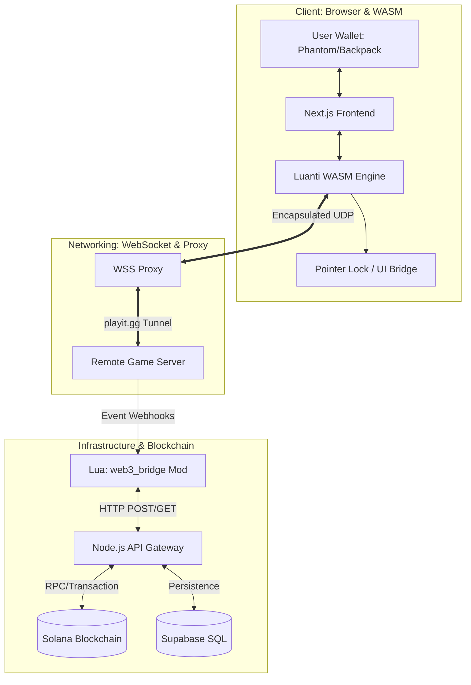

# SolCraft: The Sovereign Frontier

SolCraft is an uncompromising, browser-based Voxel-Metaverse built natively for the Solana Blockchain. It was created for the **2026 Colosseum Frontier Hackathon** to challenge the status quo of "walled garden" gaming.

In SolCraft, there are no artificial boundaries, no centralized censorship, and no safety nets. Every block you mine is a token you own; every death you suffer is a loss you feel. It is a digital state of nature where the blockchain serves as the ultimate laws of physics.

---

## 1. System Architecture & Data Flow

SolCraft utilizes a unique "Triple-Bridge" architecture to connect a high-performance C++ game engine (Luanti) with the modern Web3 stack.



---

## 2. Core Gameplay Mechanics

### The World: The Prison Island
The game world is set on a hand-crafted, resource-rich island surrounded by a seemingly infinite ocean. 
- **The Ocean Loop:** To maintain the immersion of a persistent world without "invisible walls," SolCraft implements a seamless teleportation loop. Sailing too far into the horizon will result in a seamless transition to the opposite side of the island (The Pac-Man Effect).
- **The Spawn Sanctuary:** A minuscule 10-block radius around the starting point is protected from griefing. Beyond this point, you are on your own.

### The Stakes: High-Stakes Survival
- **Omnipresent PvP:** Combat is enabled everywhere outside the spawn. 
- **Permadeath & Full Loot:** Death is final. Upon a character's demise, the Lua engine clears the player’s inventory, spawns all items as physical entities on the ground for others to scavenge, and resets the character’s local state.

---

## 3. Web3 Integration & The In-Game Economy

Every action in SolCraft has an on-chain consequence. The game does not just "support" crypto; it is built upon it.

| Category | Feature | Technical Implementation |
| :--- | :--- | :--- |
| **Tokens** | **Everything is an SPL Token** | Every block type (Dirt, Wood, Gold) maps to a specific SPL-Token Mint on Solana. |
| **Trade** | **dBlocks (Vending)** | Decentralized blocks where players store items and set prices. Interacting opens a React-Overlay to finalize the swap via Solana. |
| **Finance** | **Liquidity Pools (DEX)** | Physical DEX blocks on the island allow players to swap resource-tokens using a Jupiter-inspired UI. |
| **Identity** | **NFT Skins** | Backend verifies NFT ownership (e.g., Mad Lads). Lua scripts apply textures: `player:set_properties({textures={"madlad.png"}})` |
| **Access** | **NFT Keycards** | Steel doors that only open if the player's wallet contains a specific NFT "Keycard." |
| **Ad Space** | **Token-Gated Billboards** | In-game canvases that render external IPFS images. Ad space is rented using USDC or Solanium Coins. |

---

## 4. Project Structure

The SolCraft Monorepo is organized to separate concerns while maintaining tight integration.

```text
📁 solcraft-monorepo
 ┣ 📁 web           # Next.js Frontend: UI, Wallet Adapter, and WASM Runtime
 ┣ 📁 backend       # Node.js Express API: Middleware between Game and Blockchain
 ┣ 📁 game-server   # Luanti Engine binary and configuration
 ┃ ┗ 📁 mods
 ┃   ┗ 📁 web3_bridge  # The "Brain": Lua scripts for real-time inventory syncing
 ┣ 📄 README.md     # Project documentation
 ┗ 📄 .gitignore    # Optimization for clean version control
```

---

## 5. Deployment & Infrastructure

SolCraft is designed for low-latency performance and high availability.

- **Frontend Hosting:** [Vercel](https://vercel.com)
  - Next.js 14+ is deployed here, serving the WebAssembly game engine and the React UI.
  - Custom Domain: `https://solcraft.me`
- **Backend & Game Engine:** [Hetzner Cloud](https://hetzner.com)
  - A high-performance Ubuntu instance hosts the Luanti Game Server and the Node.js API Gateway.
  - Connectivity is maintained via a WebSocket proxy to allow browser-based clients to communicate with the native UDP game port.
- **Database:** [Supabase](https://supabase.com)
  - Used for fast, real-time synchronization of player metadata and non-critical game states.

---

## 6. The "Solanium" Economy

A unique element of SolCraft is the discovery of **Solanium**. 
1. **Mining:** Players find rare Solanium Ore deep beneath the island.
2. **Refining:** The ore must be manually smelted in a furnace (30-second duration).
3. **Minting:** The resulting Solanium Lump can be pressed into a **Solanium Coin**.
This coin serves as the baseline for all in-game trade, bridging the gap between raw labor and digital wealth.

---
